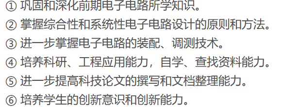

# 课程设计报告

## 目录
---

## 摘要

- 课程目的：
  
- 实现方法：
  使用ISE软件通过Verilog HDL语言编辑程序，以实现相应的模块功能。使用Xilinx公司的Spartan3AN系列的XC30S50AN硬件集成电路板下载程序，然后利用开发板接线成系统，再结合实验室示波器和数字信号发生器进行调测，最终完成课程设计要求。
- 实现情况：
  将程序下载到集成开发板上以后，对应输入端口输入频率为10K的TTL电平,经过基带信号产生电路，再经过位同步时钟提取电路，最终能在示波器上显示提取出的位同步时钟，用示波器观察该时钟信号，此时钟信号占空比接近50%，相位抖动小。
- 关键词：
  电子电路设计
  Verilog HDL语言
  Spartan3AN系列的XC30S50AN硬件集成电路板
  基带信号产生电路
  位同步时钟提取电路  

## summary

1. Course purpose
① Consolidate and deepen the knowledge learned in early electronic circuits.
② Master the principles and methods of comprehensive and systematic electronic circuit design.
③ Further master the assembly and debugging technology of electronic circuits.
④ Cultivate scientific research and engineering application capabilities, self-study and information search capabilities.
⑤ Further improve the ability to write and document scientific papers.
⑥ Cultivate students’ innovative consciousness and ability. 
2. Implementation method:
   Use ISE software to edit the program through Verilog HDL language to implement the corresponding module functions. Use Xilinx's Spartan3AN series XC30S50AN hardware integrated circuit board to download the program, then use the development board to wire it into a system, and then combine it with a laboratory oscilloscope and digital signal generator for debugging, and finally complete the course design requirements.
3. Implementation situation:
   After downloading the program to the integrated development board, the TTL level corresponding to the input port input frequency of 10K passes through the baseband signal generation circuit, and then through the bit synchronization clock extraction circuit, and finally the extracted bit synchronization clock can be displayed on the oscilloscope, using Observe the clock signal with an oscilloscope. The duty cycle of this clock signal is close to 50% and the phase jitter is small.
4. Keywords:
Electronic circuit design, Verilog HDL language, Spartan3AN series XC30S50AN hardware integrated circuit board, baseband signal generation circuit, bit synchronization clock extraction circuit

---

## 第一章 技术指标

### 1.1系统功能要求
#### 1.1.1基本要求
- （1）设计动态扫描程序，在FPGA实验板上显示学号的后六位，譬如显示012629
（2）设计制作“基带信号产生电路”，用来模拟二进制数字通信系统接收端中被抽样判决的非逻辑电平基带信号。要求：                                         
① m序列发生器的反馈特征多项式（本原多项式）为，其序列输出信号及外输入ck信号均为TTL电平，寄存器的初始值自定（不为全0或者全1均可），
完成序列信号的软件仿真并能用示波器进行实际测量,A端口需要独立引出，方便测量。
（2）当m序列发生器外输入ck信号频率为10kHz时，设计制作可从A信号中提取出位同步时钟（B信号）的电路，用示波器观察该时钟信号，要求此时钟信号占空比接近50%，相位抖动小，并数字显示同步时钟的频率，当断开A端口连接线时，时钟显示为0，示波器无时钟输出显示。   

#### 1.1.2扩展要求
- （1）改进位同步时钟提取电路，当m序列发生器外输入ck信号频率在20kHz~24kHz之间变化时，能从A信号中自适应提取位同步时钟，示波器能正确显示恢复的时钟信号，并数字显示同步时钟的频率。
（2）降低位同步时钟（B信号）的脉冲相位抖动量，要求≤1个位同步时钟周期的10%。                             （3）其他。

### 1.2系统结构要求
#### 1.2.1信号产生电路要求
- 要求“基带信号产生电路”必须是独立模块，只能用两条输出信号线（A信号线、地线）与位同步时钟提取电路部分连接。

#### 1.2.2验收要求
- 验收时，为了证明产生的时钟是恢复的时钟，而不是本地的时钟，可采用如下方法进行验证：
单独用一个fpga开发板，做有一个M序列产生装置，代替自己产生的A信号，时钟提取电路仍能能正确解析出时钟信号。

### 1.3系统电气指标
- 整个系统为同步数字系统，系统时钟根据FPGA系统板上的。
- 系统电源为：+5V，系统数字逻辑电平符合TTL电平的要求。

### 1.4系统设计条件
#### 1.4.1系统设计方法
- 可以采用试凑法或状态机（状态机加分）来描述系统逻辑和设计电路。可以用图形化、语言输入方式。
#### 1.4.2系统设计器件
- 使用可编程逻辑器件。
(注意：可编程逻辑器件的型号根据所用系统板上的芯片而定)

---

## 第二章 整体方案设计

### 2.1 算法设计

#### 2.1.1 整体功能算法设计
- 在完成课设的过程中，我想了两种实现思路，但这一部分以最后选择的一种来说明。最终方案算法设计：频率为10KHZ的输入信号首先经过基带信号产生电路，生成满足本原多项式为f(x)=x^8+x^4+x^3+x^2+1的M序列。紧接着M序列再经过一个模长为8上升沿触发的计数器，目的是产生一个与M序列同步的低频信号，该信号也与原输入信号同步。随后，再将该同步的低频信号经过位同步时钟提取电路，实现倍频，也就是将低频信号倍频成与原10KHZ输入信号同步的时钟信号，即完成了同步时钟的提取。
  
#### 2.1.2 基带信号产生电路算法设计

- M序列产生的算法设计可以分为以下几个步骤：
选择一个n阶线性反馈移位寄存器（LFSR），它有n个触发器和若干个异或门，每个触发器存储一个二进制位，异或门的输出作为反馈输入。
确定本原多项式为：f(x)=x^8+x^4+x^3+x^2+1.本原多项式决定了LFSR的反馈连接方式，即哪些触发器的输出要进行异或运算。
初始化LFSR的状态，即给每个触发器赋一个初始值，不能全为0，否则无法产生M序列。
每个时钟周期，将LFSR中的每个触发器的内容右移一位，最右边的触发器输出作为M序列的一位，最左边的触发器输入为异或门的输出。
重复上一步，直到LFSR回到初始状态，此时产生了一个长度为2^8-1的M序列。
至此，输入信号和M序列产生电路合并为基带信号产生电路。

#### 2.1.3 位同步时钟提取电路算法设计

- (1)首先,用Verilog语言编写一个模长为8的计数器，该计数器的作用就是将输入信号分频，产生一个低频信号，但是分频的同时，依旧保持与输入信号的同步。
- (2)其次，用Verilog语言实现一个2倍频电路。算法思路如下：1.首先实现将输入信号延迟其1/4个周期。利用上升沿D触发器每检测到一个上升沿，输入信号就延迟时钟的一个周期的原理，计算出所需要的D触发器个数，再结合Verilog寄存器的移位特性，最后就可以实现将输入信号延迟1/4个周期。2.其次将延时1/4周期的输入信号与原输入信号相异或，并将异或结果作为输出，该输出就是2倍频信号。
- (3)随后，先确定所选的计数器产生的低频信号，并且测量其频率，同时选择最合适的高频时钟来进行延时，以实现最少的寄存器需求。经过反复估算，最终确定选用8位计数器的D[5]作为待处理的低频信号，然后使用频率为100KHZ的高频信号作为倍频电路的时钟。
- (4)用Verilog语言编写3个顶层文件实现嵌套例化调用。第一个顶层文件通过实例化，将M序列产生电路和8位计数器连接起来，实现将原10KHZ的时钟信号生成一个与其同步的低频时钟信号，低频时钟信号周期为26ms.经过反复计算，为实现倍频后的信号与原信号的误差最小，选择将低频信号倍频256倍。第二个顶层文件用于例化倍频，首先，根据倍频电路高频输入时钟频率的大小，依次确定2-256倍频实例中所需的寄存器的长度，即寄存器长度从640依次减小两倍到5。其次，顶层文件通过实例化调用，实现将2-256倍频电路连接起来，最终完成256倍的倍频。第三个顶层文件用于串联整个位同步时钟系统，通过实例化，将之前写好的两个功能的顶层文件连接起来，最终实现将系统最开始的输入信号还原并输出的功能。

### 2.2 整体方案
#### 2.2.1 方案一
- 方案思路简述：
  本方案是针对特征方程为：f(x)=x^8+x^4+x^3+x^2+1的M序列来说，该m序列有一个特性，其总周期长度为255，它一个周期内总共的上升沿(或者下降沿)个数一共有64个，"1"序列一共有128个，所以只要测量这128个"1"序列的时间总长度再除以128就可以得到原来时钟一个周期的时间长度了。测量这128个"1"序列时间长度的方法就是，构造一个计数器，测量所有"1"序列中包含的高频时钟上升沿的个数。因为我们自己定义的高频时钟周期是已知的，且作为另一个输入时钟，所以就可以计算出一个周期内总共128个"1"序列的时间长度。但计数器如何判断是否刚好走完一整个m序列的周期？这就要构造另外一个计数器，这个计数器在每迎来一个m序列的上升沿就+1，在迎来第64个下降沿的时候就归零，并且将此时第一个计数器的计数结果输出。由第二个计数器控制M序列的长度，第一个计数器去数M序列的高电平的长度，最后将该长度除以128，即可获得原时钟信号的周期长度。最后在设计一个模块利用我们已知的周期去控制输出信号的翻转，来实现还原一个与原时钟相近的输出信号。最终将输入的10KHZ的原信号与还原出来的位同步信号分别接到示波器的两个输入通道，比较两个波形。
  在仿真的过程中我们发现，高频时钟频率频率越高还原的时钟的精度越好。


#### 2.2.2 方案二
- 方案思路简述：
  本方案的整体思路是用到锁相倍频的方法，关键技术也就在于锁相倍频电路的Verilog算法设计。本方案的大体思路是：确定了要还原的信号频率是10KHZ的TTL信号，又根据M序列的产生与输入M序列产生电路的输入信号的频率无关即只要确定了M序列的本原多项式为f(x)=x^8+x^4+x^3+x^2+1，那么无论给M序列信号产生电路送入频率为多大的时钟信号，其产生的M序列都是一样的这一前提，首先用Verilog实现一个本原多项式为f(x)=x^8+x^4+x^3+x^2+1的M序列信号产生电路。随后，设计一个模长为8的计数器，将M序列信号送入其中，用于产生一个与原10KHZ的时钟信号位同步的低频信号，该信号也就是后面倍频需要的低频信号。该低频信号周期为26ms左右，原时钟周期为0.1ms，相当于要将低频信号倍频260倍左右，该低频信号由计数器的D[5]端口输出。最后，经过反复计算和误差分析得出，用Verilog代码实现一个高频输入信号为100KHZ，低频时钟(即待倍频的信号)周期为26ms,倍频倍数为256的倍频电路，那么还原的倍频时钟与原时钟的误差是最小的，也相对稳定。最终将输入的10KHZ的原信号与还原出来的位同步信号分别接到示波器的两个输入通道，比较两个波形。

- 检测FPGA开发板的好坏：设计动态扫描程序，在FPGA实验板上显示学号的后六位，显示012616.

1. 学号后六位显示Verilog代码实现
```verilog
module stu_id(
    input clk,
	 input rst_n,
	 output reg [5:0] yima,
	 output reg [3:0] shuxuan
    );
reg [2:0] num=0;

always@(posedge clk or negedge rst_n)
    begin
    if(!rst_n)
       num <= 3'b000;
   
    else if(num == 3'b101)
	    num <= 3'b000;
	 else num <= num + 1;
    end

    always @(num)
	 case(num)
	    3'b000: begin yima<=6'b011111; shuxuan<=4'b0000; end
		  3'b001: begin yima<=6'b101111; shuxuan<=4'b0001; end
		  3'b010: begin yima<=6'b110111; shuxuan<=4'b0010; end
		  3'b011: begin yima<=6'b111011; shuxuan<=4'b0110; end
		  3'b100: begin yima<=6'b111101; shuxuan<=4'b0001; end
		  3'b101: begin yima<=6'b111110; shuxuan<=4'b0110; end
		  default: begin yima<=6'b111111; shuxuan<=4'b0000; end
     endcase

endmodule
```

2. 学号后六位显示原理图方式实现
画图下标序号**图2-1**


3. 学号后六位显示的仿真图见附录：==附录图1-1==
4. 实物图见附录：**==附录图1-2==**

### 2.3 整体方框图及原理

#### 2.3.1 方案一整体方框图
画图下标序号**图2-2**
#### 2.3.2 方案一原理
- 利用M序列的上升沿和下降沿结合计数器来实现位同步时钟信号提取是一种基于伪随机序列的同步方法，通常用于数字通信系统中。这个方法利用了以下原理和步骤：

1. M序列：M序列，也称为最大长度序列或伪随机序列，是一种特殊的二进制序列，具有良好的随机性质。M序列是由特定的反馈逻辑电路生成的，其周期长度为2^n - 1，其中n是生成序列的位数。这种序列在二进制中的取值只有0和1，但它的统计特性类似于随机序列。

2. 上升沿和下降沿：在数字信号中，上升沿表示信号从0变为1的瞬间，而下降沿表示信号从1变为0的瞬间。这些沿边在数字信号处理中常用于同步和时钟提取。

3. 计数器：计数器是一种数字电路，用于生成周期性的计数序列。在这种情况下，我们使用计数器来跟踪M序列的周期，并帮助我们提取时钟信号。

步骤如下：

1. 选择一个合适的M序列作为时钟信号的参考。通常，M序列的周期长度会与通信系统的数据速率相关。

2. 在接收端，通过比较接收到的信号与M序列的上升沿和下降沿，可以检测出信号中的时钟信息。这通常涉及到使用比较器电路或者触发器来捕捉上升沿和下降沿。

3. 通过计数器来跟踪M序列的周期。计数器的计数值会在每个M序列的周期内递增。

4. 当计数器的计数值达到预定的阈值（通常是M序列周期的一半），就可以认为时钟信号已经被成功提取了。因为M序列的周期是已知的，所以这个阈值可以很容易地计算出来。

5. 提取的时钟信号可以用于同步接收端的数据恢复，确保正确地解调和解码接收到的数据。

这种方法的关键点在于，M序列的伪随机性质使得上升沿和下降沿在信号中的位置看起来类似于随机分布，但实际上是可预测的。通过利用M序列的特性和计数器来跟踪信号的周期，可以有效地提取时钟信号，从而实现位同步，确保数据的正确传输和接收。这种方法在数字通信系统中广泛应用，特别是在低功耗和高噪声环境下。

#### 2.3.3 方案二整体方框图
画图下标序号**图2-3**

#### 2.3.4 方案二原理

这种方法是利用了锁相环（Phase-Locked Loop，PLL）的原理，结合M序列的特点来实现位同步时钟信号提取。锁相环是一种电子电路，常用于同步和跟踪输入信号的相位和频率，从而生成高稳定性的时钟信号。以下是详细说明：

1. M序列循环周期的特点：M序列是一种具有很好伪随机性质的二进制序列，其周期长度为2^n - 1，其中n是生成序列的位数。M序列的周期性质使得在整个序列中的不同位置可以找到相似的片段，这可以用于位同步时钟信号提取。

2. 低频同步信号的生成：首先，使用M序列的周期性质来生成低频的同步信号。这可以通过以下步骤实现：
   - 在接收端，检测接收到的信号，以找到M序列的起始点。这可以通过比较接收到的信号与M序列的部分序列来实现，直到找到匹配的位置。
   - 一旦找到M序列的起始点，就可以开始跟踪M序列的周期。这可以通过计数器来实现，计数器在每个M序列周期内递增。

3. 锁相倍频：一旦成功生成低频的同步信号，接下来使用锁相环将其倍频以生成高频的时钟信号。锁相环的工作原理如下：
   - 锁相环包括一个相位比较器（Phase Detector）、一个低通滤波器（Low-Pass Filter）、一个电压控制振荡器（Voltage-Controlled Oscillator，VCO）和一个反馈环路。
   - 相位比较器将输入的低频同步信号与VCO生成的高频信号进行比较，并产生一个误差信号。
   - 误差信号经过低通滤波器，将高频噪声滤除，得到一个稳定的控制电压。
   - 控制电压调节VCO的频率，使其与低频同步信号的频率保持同步，从而输出高频的时钟信号。

4. 时钟信号提取：最终的输出是高频的时钟信号，用于位同步，确保接收端能够正确地解调和解码接收到的数据。

这种方法的关键在于，通过M序列的周期性质来生成低频的同步信号，并使用锁相环将其倍频以生成高频的时钟信号。锁相环能够跟踪输入信号的相位和频率变化，从而产生稳定的时钟信号，实现位同步。这种方法在数字通信系统中常用，特别是在需要高度稳定性和抗噪声干扰的情况下，以确保数据的可靠传输。

---

## 第三章 单元电路设计

### 3.1 方案一

#### 3.1.1 方案一 测M序列“1”电平含高频时钟上升沿个数电路设计
1. 数出M序列中“1”电平的长度中含有的高频时钟上升沿的个数，目的是为了根据已知的高频时钟的周期，来计算出原时钟信号的周期。
2. 高频时钟上升沿计数电路Verilog实现：
```verilog
module custom_counter(
    input custom_input,
    input custom_clock,
    input custom_reset_n,
    output reg [13:0] custom_NOTCH, // Custom Number of Tclk_H
    output reg [13:0] custom_num,
    output reg [8:0] custom_count
);

    always @ (posedge custom_clock or negedge custom_reset_n) begin
        if (!custom_reset_n) begin
            custom_NOTCH <= 0;
            custom_num <= 0;
        end else if (custom_input) begin
            custom_NOTCH <= custom_NOTCH;
            custom_num <= custom_num + 1;
        end
    end

    always @ (posedge custom_input or negedge custom_reset_n) begin
        if (!custom_reset_n) begin
            custom_count <= 0;
        end else if (custom_count == 64) begin
            custom_count <= 0;
        end else begin
            custom_count <= custom_count + 1;
        end
    end

    always @(posedge custom_input) begin
        if (custom_count == 64) begin
            custom_NOTCH <= custom_num;
            custom_num <= 0;
        end else begin
            custom_NOTCH <= custom_NOTCH;
            custom_num <= custom_num;
        end
    end

endmodule

```

#### 3.1.2 方案一 原时钟还原电路设计
1. 利用计数电路得到的原时钟信号与高频时钟信号的周期关系，再利用计数器控制输出信号翻转，从而实现输出信号还原为与近似于原时钟信号的还原电路。
2. 原时钟还原电路Verilog实现：
```verilog
module PWM(
    input [13:0] NOTCH,
    input clk_H,rst_n,
    output clk_out,
	 output reg [6:0] count
    );
	always @ (posedge clk_H or negedge rst_n)
	begin
		if(!rst_n)
			count <= 0;
		else if(count == NOTCH/128 - 1)
			count <= 0;
		else
			count <= count + 1;
	end
	
	assign clk_out = (count <= NOTCH/256 - 1)?1:0;

endmodule
```

#### 3.1.3 方案一 位同步时钟提取电路设计
1. 用Verilog例化调用测M序列“1”电平含高频时钟上升沿个数电路和原时钟还原电路，最终串联成一个能够恢复原始时钟的位同步时钟提取电路。
2. 位同步时钟提取电路Verilog实现：
```verilog
module synchronized_counter(
    input system_clk,
    input high_frequency_clk,
    input reset_n,
    input enable,
    output synchronized_clk
);

    wire ms8_output;
    wire [13:0] counter_measurement;

    ms8_generator ms8(
        .system_clk(system_clk),
        .reset_n(reset_n),
        .enable(enable),
        .ms8_output(ms8_output)
    );

    counter_measurementT measurement_counter(
        .A(ms8_output),
        .high_frequency_clk(high_frequency_clk),
        .reset_n(reset_n),
        .NOTCH(counter_measurement[13:0])
    );

    PWM_generator final_waveform(
        .NOTCH(counter_measurement[13:0]),
        .high_frequency_clk(high_frequency_clk),
        .reset_n(reset_n),
        .synchronized_clk(synchronized_clk)
    );

endmodule

```

### 3.2 方案二

#### 3.2.1 方案二 基带信号产生电路设计

1. 为什么使用M序列来进行位同步时钟提取？
   - M序列可以用于位同步时钟的提取的原因在于它的伪随机性质和周期性特点，这使得它在数字通信中具有独特的优势。以下是为什么可以使用M序列进行位同步时钟提取的解释：

   - 伪随机性质：M序列是一种伪随机序列，它的序列值看似随机，但实际上是根据一定的算法生成的。这个特性使得M序列在数字通信中具有很好的随机性质，可以用于在接收端与传输信号进行比较。

   - 周期性：M序列的周期性质意味着在序列中会以相同的方式周期性地重复。M序列的周期长度是2^n - 1，其中n是生成序列的位数。这个周期性质使得在接收到的信号中可以找到与M序列对应的片段。

   - 已知性：生成M序列的算法是已知的，因此接收端可以知道M序列的结构和周期长度。

   - 基于以上特点，位同步时钟提取可以通过以下方式进行：

   - 在接收端，可以使用M序列的已知结构和周期性质来尝试匹配接收到的信号。通过比较接收到的信号与M序列的片段，可以检测出序列的起始点。一旦找到匹配的位置，就可以确定信号的位同步。

   - M序列的周期性质还允许接收端跟踪信号的周期。通过计数器或其他方法，接收端可以在每个M序列的周期内计数，从而实现对信号周期的跟踪。

   - 一旦信号被位同步，就可以生成稳定的时钟信号，确保接收端能够正确地解调和解码接收到的数据。

总的来说，M序列由于其伪随机性和周期性质，提供了一种有效的方法来在数字通信中进行位同步时钟的提取。这种方法允许接收端通过检测信号与M序列的匹配来实现同步，从而确保数据的正确传输。

2. 本原多项式为f(x)=x^8+x^4+x^3+x^2+1的M序列有什么特点？
   - M序列是一种伪随机二进制序列，由线性反馈移位寄存器（LFSR）产生，其特点受到生成多项式的影响。对于给定的本原多项式f(x)，即f(x) = x^8 + x^4 + x^3 + x^2 + 1，生成的M序列将具有以下特点：

    - 周期性：M序列的周期长度由本原多项式的次数决定。在这种情况下，本原多项式的次数为8，因此生成的M序列将具有2^8 - 1 = 255个位的周期性。这意味着序列将在255个位后重复。

   - 伪随机性：M序列在其周期内表现出伪随机性质，其序列值看似随机，但实际上是由本原多项式的线性反馈移位寄存器生成的，因此是可预测的。

   - 最大长度序列：由于本原多项式具有最大的次数，生成的M序列被称为最大长度序列（Maximum Length Sequence），这种序列在LFSR的特定配置下能够达到最大可能的周期性。

   - 均匀分布性质：M序列的位值（0或1）在其周期内大致均匀分布，这使得它在应用中具有良好的伪随机性质，例如在信号处理、通信系统和密码学中常被用作伪随机序列生成器。

   - 自相关性和互相关性：M序列的自相关性和互相关性通常呈现出明显的周期性，这些性质在信号同步、编码和解码等应用中有重要作用。

总之，对于给定的本原多项式f(x) = x^8 + x^4 + x^3 + x^2 + 1，生成的M序列是一种具有最大周期性和伪随机性质的序列，适用于各种应用领域，尤其是数字通信和密码学中。

3. M序列Verilog代码实现：

```verilog
module unique_sequence_gen8(
    input clk,
    input reset,
    input enable,
    output sequence_out,
    output reg [0:7] register8
    );
	assign sequence_out = register8[0];
	parameter INITIAL_VALUE = 8'b0000_0001;
	always @ (posedge clk or negedge reset)
	begin
		if (!reset)
			register8 <= INITIAL_VALUE;
		else if (enable)
		begin
			register8[0] <= register8[1];
			register8[1] <= register8[2];
			register8[2] <= register8[3];
			register8[3] <= register8[4];
			register8[4] <= register8[5];
			register8[5] <= register8[6];
			register8[6] <= register8[7];
			register8[7] <= register8[0] ^ register8[4] ^ register8[5] ^ register8[6];
		end
		else
			register8 <= register8;
	end
endmodule
```


#### 3.2.2 方案二 8位计数器电路设计

1. 为什么选择同步计数器来作为分频器，其分频的原理和优点是什么？

   - 同步计数器分频是一种常见的数字电路技术，它的原理是所有触发器都受到相同的时钟信号，它们在时钟的边沿（上升沿或下降沿）上同时触发，以实现输入信号的分频。以下是同步计数器分频的原理和优点：

   **原理**：

   1. **时钟信号**：同步计数器分频的关键是一个共享的时钟信号，所有触发器都以这个时钟信号为基础进行状态转换。

   2. **二进制计数**：计数器内部使用二进制计数来计算状态。每当时钟信号触发，计数器的当前状态按照二进制规则加1。

   3. **输出脉冲生成**：根据计数器的当前状态，可以设置一个特定的计数值，当计数器达到这个值时，生成一个输出脉冲，然后重新从零开始计数。这个输出脉冲的频率是输入信号的频率除以分频比。

   **优点**：

   1. **精确性**：同步计数器分频非常精确，因为所有触发器都在相同的时刻根据相同的时钟信号进行状态转换。这导致分频的结果非常可靠，不受时序问题或触发器之间的不稳定性影响。

   2. **可控性**：通过适当选择计数器的计数值，可以轻松地实现所需的分频比。这使得同步计数器非常适合需要精确分频的应用，例如通信系统和频率合成器。

   3. **稳定性**：同步计数器在时序上非常稳定，因为所有触发器都受到相同的时钟信号的控制。这有助于防止时序问题和时序冲突。

   4. **可扩展性**：如果需要更高的分频比，可以轻松地将多个同步计数器级联在一起，而不会引入不稳定性。

   总的来说，同步计数器分频是一种精确、可靠且可控制的分频技术，适用于许多应用，特别是需要高精度分频的情况。然而，它可能需要更多的硬件资源和功耗，因此在一些特殊的低功耗应用中可能会选择其他分频方法。

2. 8位同步计数器的Verilog实习：
   ```verilog
   module count_8(clk,rst,D
    );
    input clk;
	 input rst;
	 reg [7:0] count;
	 output D;
	 
	 always@(posedge clk or negedge rst)
	 begin
	 if (!rst)
	     count <= 8'b00000000;
	 else  
	     count <= count+8'b00000001;
	 end
	 assign D = count[5];
	 endmodule
   ```


#### 3.2.3 方案二 顶层低频信号输出电路设计
1. 顶层低频信号输出电路
   - 利用顶层文件将M序列产生电路与8位计数器相串联，从而形成一个整体的同步低频信号产生电路。
2. 顶层文件Verilog实现：

   ```verilog
   module top_module_count(clk,out,rst_m
    );
	 input clk;
	 output out;
	 input rst_m;
	 wire Q;
	 
	 m_sequence_daima m_seq(
	 .sclk(clk),                                                                               .rst_n(rst_m),
	 .m_seq(Q)
	 );
	 
	 count_8 xcount(
	 .clk(Q),
	 .rst(rst_m),
	 .D(out)
	 );
   endmodule
   ```

#### 3.2.4 方案二 分频电路设计

1. 为什么要设计分频器？
   1. 现成的开发板上只有2M、1K、2K、4K、8K频率的时钟信号，无法满足课程设计的需求，因此需要单独设计偶数和奇数分频器，以便将现有时钟分频成满足我们需求的时钟信号频率。
2. 任意奇数分频Verilog实现：
   ```verilog
   module fenpin_jishu
   #(
   parameter DIV_NUM = 5
   )
   (

   input clk,
   input rst_n,
   output clk_out

   );

   reg [3:0] div_cnt1;
   reg div_clk1;
   always@(posedge clk or negedge rst_n)begin
	 if(!rst_n)begin
		div_cnt1 <= 'b0;
		div_clk1 <= 'b0;
	 end
	 else if(div_cnt1 != DIV_NUM - 1 + (DIV_NUM-1)/2) //多加了一个 (DIV_NUM-1)/2
		div_cnt1 <= div_cnt1 + 1;
	 else begin
		div_cnt1 <= (DIV_NUM-1)/2;                  //复位的值为 (DIV_NUM-1)/2
		div_clk1 <= ~div_clk1;
	 end
   end

   reg [3:0] div_cnt2;
   reg div_clk2;
   always@(negedge clk or negedge rst_n)begin
	 if(!rst_n)begin
		div_cnt2 <= 'b0;
		div_clk2 <= 'b0;
	 end
	 else if(div_cnt2 != DIV_NUM - 1 )
		div_cnt2 <= div_cnt2 + 1;
	 else begin
		div_cnt2 <= 0;
		div_clk2 <= ~div_clk2;
	 end
   end

   assign clk_out = div_clk1 ^ div_clk2;

   endmodule
   ```

3. 任意偶数分频Verilog实现：

   ```verilog
   module fenpin_1200
   #(
	 parameter num = 200
   )
   (
	 input clk,
	 input rst_n,
	 output reg clk_out
   );

   reg [9:0]cnt;
   always@(posedge clk or negedge rst_n)begin
	 if(!rst_n)begin
		cnt <= 0;
		clk_out <= 0;
	  end
	 else if(cnt == num/2 -1)begin
		cnt <= 0;
		clk_out <= ~clk_out; 
	 end	
	 else
		cnt <= cnt + 1'b1;
   end

   endmodule

  
   ```

#### 3.2.5 方案二 倍频电路设计
1. 倍频的目的以及实现方法：
   1. 倍频的目的：
       倍频主要就是为了将前面的同步的低频信号(周期约为26ms)倍频为与原信号接近的位同步时钟(周期约为0.1ms)。 
   2. 倍频实现方法：
       首先用Verilog实现一个2倍频电路，然后再写一个顶层文件例化调用这个2倍频电路，最终实现256倍的倍频。
2. 8倍频电路Verilog实现：
   1. 8倍频电路所采用的的高频时钟是400K，由开发板上的2M时钟分频得到。经过计算，倍频过程中从小到大依次所需的寄存器的长度为100，50，25.
   2. 2倍频Verilog实现：
       ```verilog
       module D_chufaqi_n(
       input wire clk,        // 时钟信号
       input wire rst,        // 复位信号
       input wire d_in,       // 输入数据信号
       output wire d_out      // 输出数据信号
       );

        reg [99:0] delay_line;   // 25个D触发器的延时线

       always @(posedge clk or negedge rst) 
       begin
       if (!rst) 
       begin
       // 复位时，清零所有延时线
       delay_line <= 100'b0;
       end 
       else 
       begin
       // 依次传递延时
       delay_line[0] <= d_in;
       delay_line[99:1] <= delay_line[98:0];
        end
       end

        assign d_out = delay_line[99]^d_in;  // 输出最后一个延时线的值

        endmodule
        ```
   3. 顶层文件例化实现8倍频：
       ```verilog
       module beipin_zuoye_8(inH,inL,rst,out
        );
        input inH;
        input inL;
        input rst;
        output out;

        wire W1;
        wire W2;
        wire W3;

        fenpin_2M_400K fenpin_2_400( //2M分频为400K
	      .clk(inH),
	      .rst_n(rst),
	      .clk_out(W1)
	      );
	 
        D_chufaqi_n beipin_2(
        .clk(W1),
        .rst(rst),
        .d_in(inL),
        .d_out(W2)
        );
   
        D_chufaqi_2_4 beipin_4(
        .clk(W1),
        .rst(rst),
        .d_in(W2),
        .d_out(W3)
        );
        
        D_chufaqi_4_8 beipin_8(
        .clk(W1),
        .rst(rst),
        .d_in(W3),
        .d_out(out)
        );
        endmodule
        ```
3. 256倍频电路Verilog实现：
     1. 256倍频电路所采用的高频时钟频率为100K，经过计算，倍频过程中所需要的寄存器的长度从小到大依次为640,320,160,80,40,20,10,5。
     2. 顶层文件实现256倍频：
         ```verilog
         module top_beipin_1_256(clk,rst,d_in,d_out
          );
          input clk;
          input rst;
          input d_in;
          output d_out;

          wire Q1;
          wire Q2;
          wire Q3;
          wire Q4;
          wire Q5;
          wire Q6;
          wire Q7;

          D_chufaqi_n biepin_1_2(
          .clk(clk),
          .rst(rst),
          .d_in(d_in),
          .d_out(Q1)
          );

          beipin_4 beipin_2_4(
          .clk(clk),
          .rst(rst),
          .d_in(Q1),
          .d_out(Q2)
          );

          beipin_8 beipin_4_8(
          .clk(clk),
          .rst(rst),
          .d_in(Q2),
          .d_out(Q3)
          );
          
          beipin_16 beipin_8_16(
          .clk(clk),
          .rst(rst),
          .d_in(Q3),
          .d_out(Q4)
          );
          
          beipin_32 beipin_16_32(
          .clk(clk),
          .rst(rst),
          .d_in(Q4),
          .d_out(Q5)
          );
          
          beipin_64 beipin_32_64(
          .clk(clk),
          .rst(rst),
          .d_in(Q5),
          .d_out(Q6)
          );
          
          beipin_128 beipin_64_128(
          .clk(clk),
          .rst(rst),
          .d_in(Q6),
          .d_out(Q7)
          );
          
          beipin_256 beipin_128_256(
          .clk(clk),
          .rst(rst),
          .d_in(Q7),
          .d_out(d_out)
          );
	  
	 
          endmodule
          ```


#### 3.2.6 方案二 位同步时钟提取电路设计
1. 编写Verilog代码例化之前设计的顶层低频信号输出电路以及256倍倍频电路，最终整合成一个位同步时钟提取电路，该电路能够还原最初送入系统的10KHZ的信号，此时钟信号占空比接近50%，相位抖动小。
2. Verilog实现Final顶层文件：
    ```verilog
    module top_final_2(inL,inH,rst,out
    );
    input inL;
    input inH;
    input rst;
    output out;

    wire Q1;

    M_seq_count M_seq(
	 .clk(inL),
	 .rst_m(rst),
	 .out(Q1)
	 );
    
	 top_beipin_1_256 beipin_1_256(
	 .clk(inH),
	 .rst(rst),
	 .d_in(Q1),
	 .d_out(out)
	 );
	 
    endmodule
    ```

### 3.3 整机元件清单
1. XILINX SPARTAN XC3S50AN TQG144AGQ2119 D6235401A 4C 1个
2. XILINX status 高速仿真器 1个
3. typeC数据线
4. 数字信号发生器
5. 示波器
6. 导线若干
7. 数据下载线

---

## 第四章 调试

### 4.1 方案一调试

#### 4.1.1 整体指标调试
1.方案一位同步时钟提取电路整体指标调试代码：

```verilog
`timescale 1ns / 1ps
module tb_top_module_tongbu;

	// Inputs
	reg clk;
	reg clk_H;
	reg rst_n;
	reg en;

	// Outputs
	wire clk_out;

	// Instantiate the Unit Under Test (UUT)
	top_module_tongbu uut (
		.clk(clk), 
		.clk_H(clk_H), 
		.rst_n(rst_n), 
		.en(en), 
		.clk_out(clk_out)
	);

	initial begin
		// Initialize Inputs
		clk = 0;
		clk_H = 0;
		rst_n = 0;
		en = 0;

		// Wait 100 ns for global reset to finish
		#100;
      rst_n = 1;
		en = 1;  
		// Add stimulus here

	end
      always #50000 clk = ~clk;
		always #500 clk_H = ~clk_H;
endmodule
```
2. 该方案在程序下载到开发板上后，虽然仿真无错，但是无法在示波器上稳定显示还原时钟的波形，并且存在误差，因此不首选该方案。
3. 方案一位同步时钟提取电路仿真图：
  - 见附录图1-1和附录图1-2

### 4.2 方案二调试

#### 4.2.1 基带信号产生电路调试
1. 基带信号产生电路测试代码：
    ```verilog
    `timescale 1ns / 1ps
    module tb_m_sequence_daima;

        // Inputs
        reg sclk;
        reg rst_n;

        // Outputs
        wire m_seq;

        // Instantiate the Unit Under Test (UUT)
        m_sequence_daima uut (
          .sclk(sclk), 
          .rst_n(rst_n), 
          .m_seq(m_seq)
        );

        initial begin
          // Initialize Inputs
          sclk = 0;
          rst_n = 1;

          // Wait 100 ns for global reset to finish
          #100;
            rst_n = 0;
            #100;
            rst_n = 1;		
          // Add stimulus here

        end
            always #500000 sclk = ~sclk;
      endmodule
    ```
    
2. M序列仿真以及实物波形图

   - 仿真图见附录 ==附录图2-3==
   - 实物波形图见附录 ==附录图2-4和附录图2-5==

#### 4.2.2 8位计数器电路调试
1. 8位计数器电路测试代码：
   ```verilog
      `timescale 1ns / 1ps

      module tb_count_8;

      // Inputs
      reg clk;
      reg rst;

      // Outputs
      wire D;

      // Instantiate the Unit Under Test (UUT)
      count_8 uut (
        .clk(clk), 
        .rst(rst), 
        .D(D)
      );

      initial begin
        // Initialize Inputs
        clk = 0;
        rst = 0;

        // Wait 100 ns for global reset to finish
        #100;
          rst = 1;  
        // Add stimulus here

      end
          always #10 clk = ~clk;
      endmodule
    ```
2. 8为计数器仿真图见附录 ==附录图2-6==

#### 4.2.3 顶层低频信号输出电路调试
1. 顶层低频信号输出电路测试代码：
   ```verilog
   `timescale 1ns / 1ps

   module tb_top;

    // Inputs
    reg clk;
    reg rst_m;

    // Outputs
    wire out;

    // Instantiate the Unit Under Test (UUT)
    top_module_count uut (
		.clk(clk), 
		.out(out), 
		.rst_m(rst_m)
	  );

	  initial begin
		// Initialize Inputs
		clk = 0;
		rst_m = 1;

		// Wait 100 ns for global reset to finish
		#100;
      rst_m = 0;
		#100;
		rst_m = 1;
		// Add stimulus here

	  end
      always #500000 clk = ~clk;//10KHZ
    endmodule
   ```
2. 低频信号输出电路整体仿真及实物图：

   - 低频信号仿真图见附录图2-7
   - 低频信号实物图见附录图2-8

#### 4.2.4 分频电路调试
1. 分频电路测试代码：
   1. 奇数分频测试代码：
      ```verilog

      `timescale 1ns / 1ps

      module tb_fenpin_jishu;

	    // Inputs
      reg clk;
      reg rst_n;

      // Outputs
      wire clk_out;

        // Instantiate the Unit Under Test (UUT)
        fenpin_jishu uut (
        .clk(clk), 
        .rst_n(rst_n), 
        .clk_out(clk_out)
      );

	      initial begin
		  // Initialize Inputs
        clk = 0;
        rst_n = 1;

        // Wait 100 ns for global reset to finish
        #100;
          rst_n = 0;
          #100;
          rst_n = 1;		
        // Add stimulus here

        end
          always #10 clk = ~clk;
        endmodule
    
        ```

   2. 偶数分频测试代码：
    ```verilog
      `timescale 1ns / 1ps
      module tb_fenpin_1200;

      // Inputs
      reg clk;
      reg rst_n;

      // Outputs
      wire clk_out;

	    // Instantiate the Unit Under Test (UUT)
	    fenpin_1200 uut (
		  .clk(clk), 
		  .rst_n(rst_n), 
		  .clk_out(clk_out)
	    );

	    initial begin
		  // Initialize Inputs
		  clk = 0;
		  rst_n = 0;

		  // Wait 100 ns for global reset to finish
		  #100;
      rst_n = 1;  
		  // Add stimulus here

	    end
      always #10 clk = ~clk;
      endmodule
      ```
2. 仿真图：
   1. 任意奇数分频仿真见附录图2-9
   2. 任意奇数分频仿真见附录图2-10

#### 4.2.5 倍频电路调试
1. 倍频电路测试代码：
   1. 8倍频电路测试代码：
   ```verilog
   `timescale 1ns / 1ps
    module tb_beipin_zuoye_8;

    // Inputs
    reg inH;
    reg inL;
    reg rst;

    // Outputs
    wire out;

	  // Instantiate the Unit Under Test (UUT)
	  beipin_zuoye_8 uut (
		.inH(inH), 
		.inL(inL), 
		.rst(rst), 
		.out(out)
	  );

	  initial begin
		// Initialize Inputs
		inH = 0;
		inL = 0;
		rst = 1;

		// Wait 100 ns for global reset to finish
		#100;
      rst = 0;
      #100;
      rst = 1;		
		// Add stimulus here

	  end
      always #250 inH = ~inH;
		always #500000 inL = ~inL;
    endmodule
   ```
   2. 256倍频电路测试代码：
   ```verilog
   `timescale 1ns / 1ps
   module tb_beipin_1_256;

    // Inputs
    reg clk;
    reg rst;
    reg d_in;

    // Outputs
    wire d_out;

	  // Instantiate the Unit Under Test (UUT)
	  top_beipin_1_256 uut (
		.clk(clk), 
		.rst(rst), 
		.d_in(d_in), 
		.d_out(d_out)
	  );

	  initial begin
		// Initialize Inputs
		clk = 0;
		rst = 1;
		d_in = 0;

		// Wait 100 ns for global reset to finish
		#100;
      rst = 0;
      #100;
      rst = 1;		
		// Add stimulus here

	  end
      always #5000 clk = ~clk;
		always #13000000 d_in = ~d_in;
    endmodule
   ```

2. 8倍频电路仿真及实物图
   - 仿真图见附录图2-11
   - 实物图见附录图2-12
3. 256倍频电路仿真
   - 仿真图见附录图2-13

#### 4.2.6 位同步时钟提取电路调试(整体指标调试)
1. 位同步时钟提取电路测试代码：
```verilog
`timescale 1ns / 1ps
module tb_top_final_2;

	// Inputs
	reg inL;
	reg inH;
	reg rst;

	// Outputs
	wire out;

	// Instantiate the Unit Under Test (UUT)
	top_final_2 uut (
		.inL(inL), 
		.inH(inH), 
		.rst(rst), 
		.out(out)
	);

	initial begin
		// Initialize Inputs
		inL = 0;
		inH = 0;
		rst = 1;

		// Wait 100 ns for global reset to finish
		#100;
      rst = 0;
      #100;
      rst = 1;		
		// Add stimulus here

	end
      always #50000 inL = ~inL;
		always #5000 inH = ~inH;
endmodule

```
2. 位同步时钟提取电路仿真及实物图：
    - 仿真图见附录图2-14
    - 实物图见附录图2-15

---

## 第五章 设计小结

### 5.1 设计任务完成情况
1. 经过快两周的课程设计学习，我实现了课程设计的基本要求。我用Verilog代码所实现的位同步时钟提取电路包含设计制作的“基带信号产生电路”，用来模拟二进制数字通信系统接收端中被抽样判决的非逻辑电平基带信号并且满足要求：m序列发生器的反馈特征多项式（本原多项式）为，其序列输出信号及外输入ck信号均为TTL电平，寄存器的初始值自定（不为全0或者全1均可），完成序列信号的软件仿真并能用示波器进行实际测量。此外，其还能够实现当m序列发生器外输入ck信号频率为10kHz时，从过程低频信号中提取出位同步时钟的电路，用示波器观察该时钟信号，要求此时钟信号占空比接近50%，相位抖动小。

### 5.2 问题及改进
1. 
   - 问题：直接将分频器的输出端口的低频信号作为下一级的输入信号，那么可能会导致后面系统的不稳定。
   - 改进：分频器将开发板晶振分频并将输出作为下一级的输入信号并没有连接到全局时钟网络上，但是输入时钟是连接到全局时钟网络上的，因此，在高速网络上基于晶振时钟的信号会比基于分频后得到的时钟更加的稳定。
2. 
   - 问题：在实现倍频电路的时候，如果计数器的输出端口选择不当，以及倍频电路高频时钟频率不恰当，那么会导致需要数量很大的寄存器来组装电路。
   - 改进：先建立数学模型，然后再进行反复计算，得出倍频电路所需的误差最小的，并且寄存器戏群最小的电路组合。


### 5.3 心得体会
1. 完成了这次电子电路课程设计，我觉得收获颇丰。本次我的题目是“位同步时钟提取电路”，这是一个非常有趣和有挑战性的课程设计，让我学习到了很多关于电子电路和数字电路的知识和技能。首先，我对这个课程设计的背景和目的进行了一些调研。我了解到，位同步时钟提取电路是一种从数据流中提取时钟信号的电路，它可以用于串行通信或其他应用。时钟信号是一种周期性的脉冲信号，它用于同步数据的发送和接收。在串行通信中，数据是以位为单位逐个发送的，因此需要有一个与发送方和接收方相同的时钟信号来保证数据的正确传输。然而，在实际情况中，由于传输介质、噪声、干扰等因素的影响，时钟信号可能会发生偏移、失真、抖动等现象，导致数据的错误或丢失。因此，需要有一种方法来从数据流中恢复出一个稳定、准确、同步的时钟信号，这就是位同步时钟提取电路的作用。其次，我对这个课程设计的原理和方法进行了一些学习。经过老师的指导，我最后采用了结合M序列循环周期的特点，先产生低频的同步信号，然后把此信号锁相倍频成时钟信号的方法。这个实现方案在Verilog代码编写过程中并不简单，但是最终我依旧按照各项指标完成了代码设计，收获了满满的成就感。通过这次课程设计，我感受到了电子电路的魅力和乐趣，也提高了我的动手能力和创新能力。我学会了如何从问题的背景和目的出发，进行调研和学习，找到合适的原理和方法，进行设计和仿真，测试和优化，最终实现一个满足要求的电路。我也发现了自己在电子电路方面的不足和需要改进的地方，比如对Verilog代码还是不太熟练，对一些电路的分析和调试不够熟练等。我希望在未来的学习中，我能够继续深入探索电子电路的知识和技能，拓展我的视野和思维，提升我的水平和能力，为我的专业发展打下坚实的基础。

---

## 附录

---

## 参考文献
1. 一种位同步时钟提取方案及实现《无线电工程》2003年 第10期 | 王兰勋 荣民   河北大学
2. 基于CPLD的位同步时钟提取电路设计《电子元器件应用》2006年 第9期 | 王志梁 刘笃仁   西安电子科技大学
3. 一种快速位同步时钟提取方案及实现《电子设计应用》2007年 第12期 | 靖文 李斌 屈薇 宋开鑫   沈阳理工大学 东北大学
4. M 序列的位同步时钟的提取与恢复《数码世界》2017年第9期
